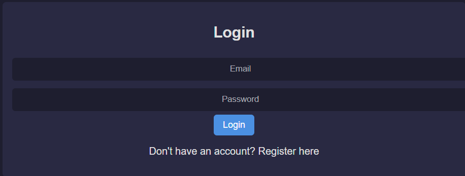
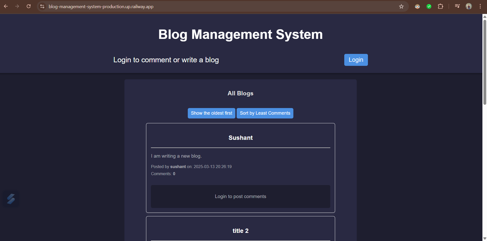
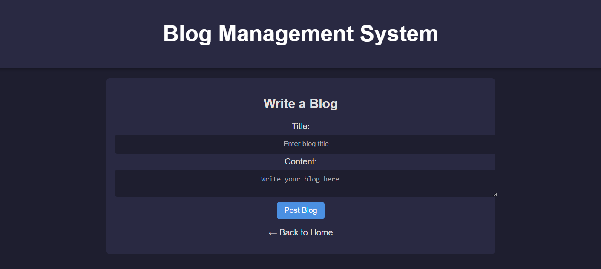

# 📝 Blog Management System


A **full-stack web application** built using **Node.js**, **Express.js**, **SQLite3**, and **vanilla HTML/CSS/JavaScript** that allows users to register, log in, write blogs, and comment on posts. The system supports **role-based access** (authors vs. readers), **blog/comment CRUD operations**, and **dynamic sorting** of blog posts.

---

## 🚀 Live Demo

🌐 [Live Website](https://your-frontend-link.com)  
🔗 [Backend API on Railway](https://blog-management-system-production.up.railway.app)  

---

## 📸 Features at a Glance

- 👥 **User Authentication**
  - Register/Login functionality
  - Secure password hashing using `bcryptjs`
  - JWT-based authentication
- 🧑‍💻 **Role-Based Access**
  - **Authors** can create, edit, delete blogs
  - **Readers** can add, edit, delete comments
- 📰 **Blog Management**
  - Display blogs by all authors
  - Each blog shows title, content, timestamp, author name
- 💬 **Commenting System**
  - Readers can engage by commenting on blog posts
  - Edit/delete own comments
- 📊 **Sorting**
  - Sort blogs by **date** (ascending/descending)
  - Sort blogs by **number of comments**
- 📱 **Responsive UI**
  - Mobile-first design with modern layout and color palette

---

## 📁 Project Structure

```
Blog-Management-System/
│
├── public/
│   ├── home.html
│   ├── login.html
│   ├── register.html
│   ├── write-blog.html
│   ├── styles.css
│   └── script.js
│
├── routes/
│   ├── authRoutes.js
│   ├── blogRoutes.js
│   └── commentRoutes.js
│
├── database.js
├── server.js
├── .env
├── package.json
└── README.md
```

---

## 🛠️ Tech Stack

- **Frontend:** HTML, CSS, JavaScript (Vanilla)
- **Backend:** Node.js, Express.js
- **Database:** SQLite3
- **Authentication:** JWT, bcryptjs
- **Hosting:** GitHub Pages (Frontend), Railway.app (Backend)

---

## 🧪 Test Cases

| Feature            | Scenario                                      | Status  |
|--------------------|-----------------------------------------------|---------|
| User Login         | Valid & invalid credentials                  | ✅      |
| Blog Creation      | Author can post/edit/delete blogs            | ✅      |
| Comment System     | Reader can add/edit/delete comments          | ✅      |
| Sorting Blogs      | Toggle between time & comment-based sorting  | ✅      |
| Role-Based Access  | Buttons/Access change based on user role     | ✅      |
| Responsiveness     | Works on mobile, tablet, desktop              | ✅      |

---

## 🔒 Security

- Passwords are hashed using `bcryptjs`
- Authentication is managed via `JWT` tokens
- Role-based UI ensures unauthorized actions are blocked

---

## 🔮 Future Enhancements

- Migrate from SQLite to **PostgreSQL** for scalability
- Implement **Admin Dashboard** for moderation
- Enhance frontend with **React.js**
- Add **Real-Time Notifications**
- Set up **automated testing** using Jest/Cypress

---

## 📷 Screenshots


### 🔐 Login Page


### 📝 Home Page with Blogs


### 🧑‍💻 Write a Blog (Author Only)


### 💬 Comments Section


### 🔽 Sort Feature (Time & Comments)


---

## 🧑‍💻 Getting Started

### ✅ Prerequisites
- Node.js & npm installed

### 📦 Installation
```bash
git clone https://github.com/your-username/Blog-Management-System.git
cd Blog-Management-System
npm install
```

### ⚙️ Set Environment Variables
Create a `.env` file:
```
JWT_SECRET=your_jwt_secret
PORT=5000
```

### ▶️ Run the App
```bash
node server.js
```

Then open `public/home.html` in your browser (or serve with Live Server)

---

## 🤝 Contributing

Pull requests are welcome! For major changes, please open an issue first to discuss what you'd like to change.

---

## 📄 License

This project is open-source and available under the [MIT License](LICENSE).

---

## ✨ Acknowledgements

- [Express.js](https://expressjs.com/)
- [SQLite3](https://www.sqlite.org/)
- [JWT](https://jwt.io/)
- [bcryptjs](https://www.npmjs.com/package/bcryptjs)
- [Railway](https://railway.app/)
- [GitHub Pages](https://pages.github.com/)
